# Design Document: MCP Events Serverless Agent — Earthquake Monitoring

## Overview

This system demonstrates the experimental MCP Events extension using webhook delivery mode to wake up a serverless agent, applied to a real-world earthquake monitoring use case. The architecture implements an event-driven wake/sleep pattern where a Strands Agent running on AWS Lambda remains dormant (zero running compute) until one of two MCP servers delivers an event via webhook to an API Gateway endpoint.

The design supports **multiple customers**, each with their own independent agent session, tailored subscription parameters, and custom briefing prompts. Each customer gets their own webhook subscriptions to both MCP servers, parameterized with customer-specific filters (e.g., minimum magnitude, geographic region). When events arrive, the system routes them to the correct customer's session based on subscription ID lookup, ensuring complete session isolation between customers.

The design uses two MCP servers feeding per-customer agent sessions: (1) a USGS Earthquake Feed Server that polls the USGS earthquake API and emits earthquakes as MCP events, filtered per subscription based on customer parameters, and (2) a Scheduler Server that emits time-based trigger events per customer on their configured schedule. This demonstrates that a single MCP Client/Host can manage subscriptions for multiple customers across multiple MCP servers simultaneously.

The agent uses the **conversation history as the accumulator**. When earthquake events arrive, the agent wakes, identifies the customer from the subscription ID, restores that customer's session directly from S3 using the Strands SDK `SessionManager` with `S3Storage`, injects the earthquake data as a user message, invokes the LLM which responds with analysis, persists the updated conversation history to S3, and exits. When a customer's briefing trigger arrives, the agent wakes, loads the customer's session (which contains all earthquake observations as conversation history), invokes the LLM with a briefing trigger message, the LLM synthesizes everything in its context and calls the `save_report` tool to persist the report via the Data API, and exits. The Serverless Agent owns its session bucket directly — only the agent ever reads/writes session state, so there is no reason to route it through an API. A shared Data API (API Gateway + Lambda) encapsulates persistence operations for customer config and reports, and is called by both the Serverless Agent (via IAM SigV4 auth) and the webapp frontend (via Cognito JWT). A separate Subscription Manager Lambda iterates over all active customers and refreshes their webhook subscriptions on both servers.

## Architecture

### High-Level Overview

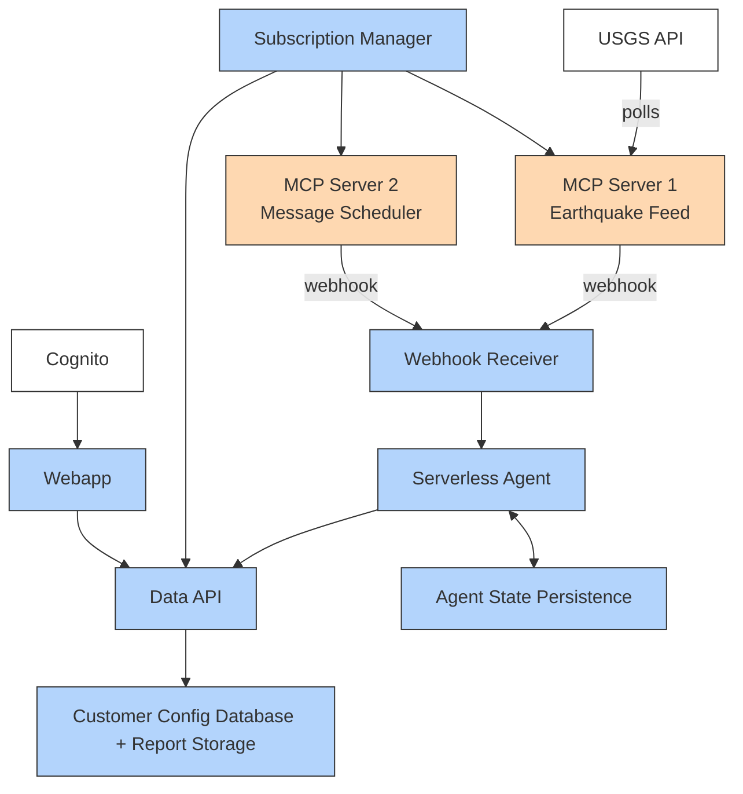

**Color Legend:**

- 🟧 Orange (`#fed8b1`) = MCP Server (declares events, manages subscriptions, delivers webhooks)
- 🟦 Blue (`#b3d4fc`) = MCP Client/Host application (subscribes to events, processes them, manages state, webapp)
- ⬜ White = External systems (USGS API, Amazon Cognito)

_Colors chosen from ColorBrewer-safe palettes for colorblind accessibility. Distinguishable in grayscale._

### MCP Server 1: USGS Earthquake Feed

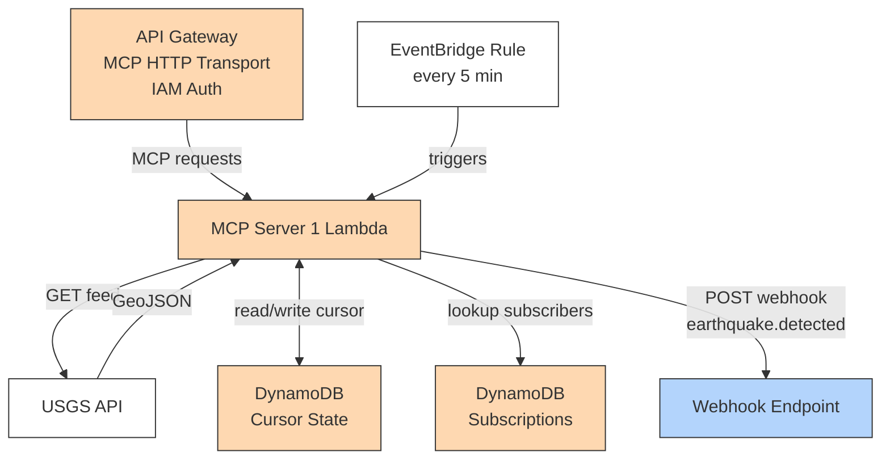

### MCP Server 2: Message Scheduler

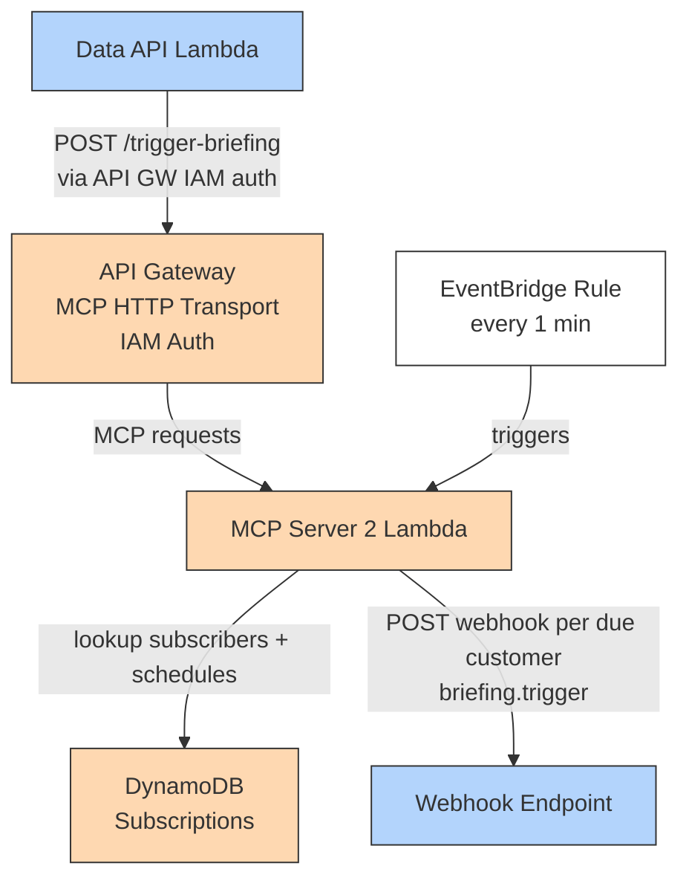

### MCP Client/Host: Event Processing with Customer Routing

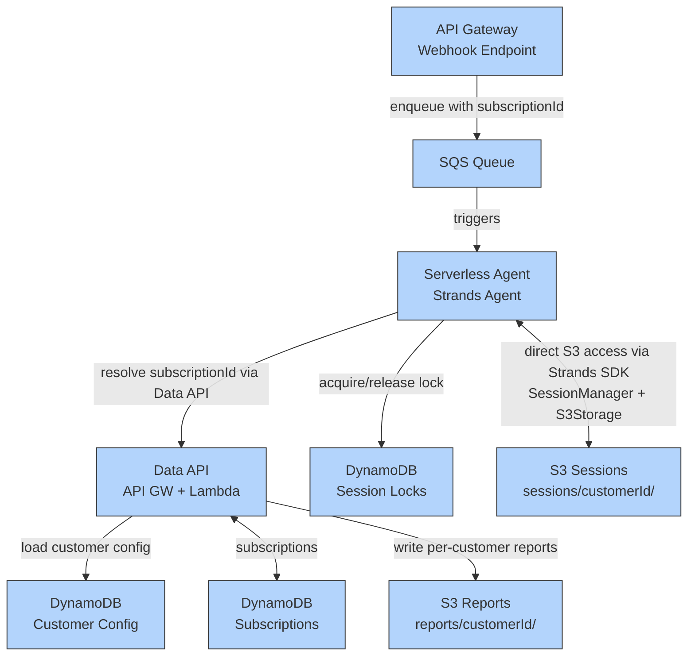

### Subscription Management (Per-Customer)

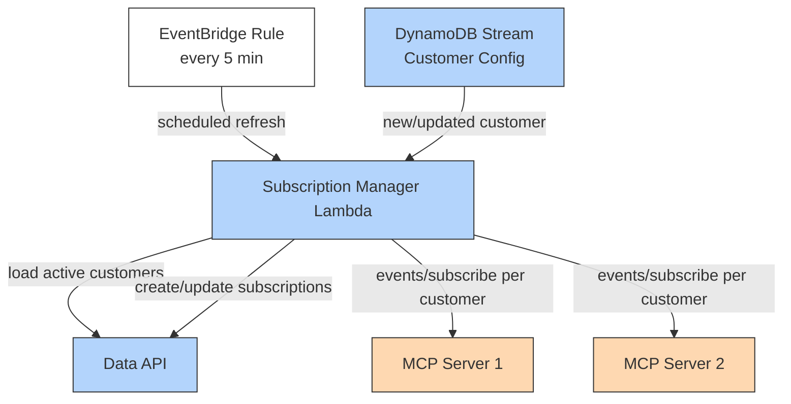

### Customer Registration Flow

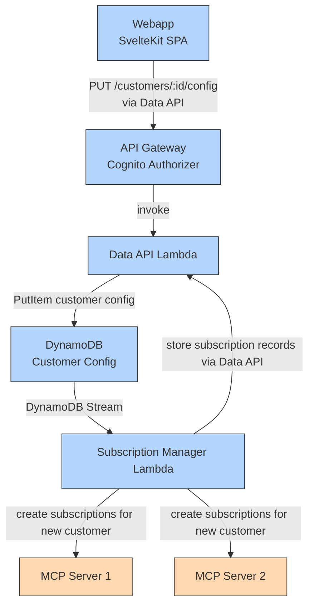

### Webapp Architecture

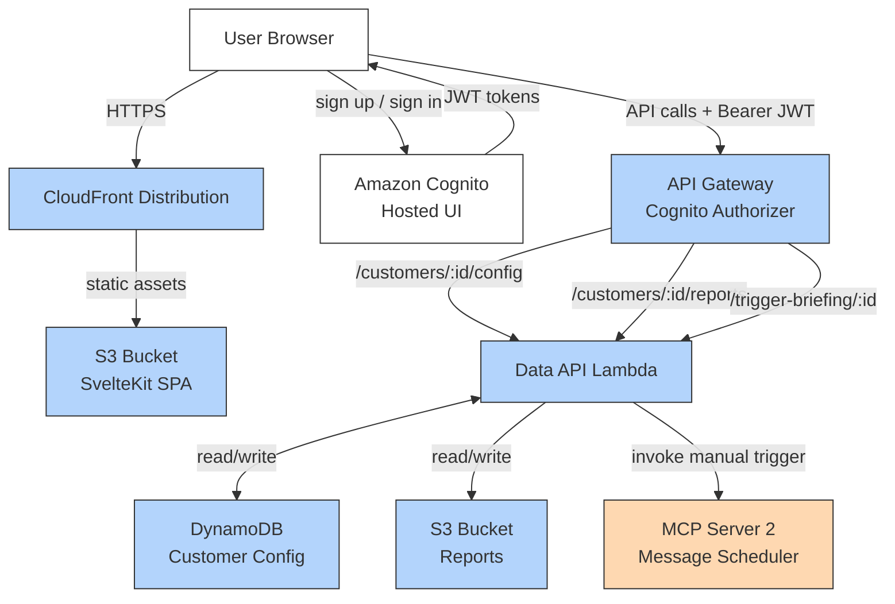

### MCP Protocol Boundary

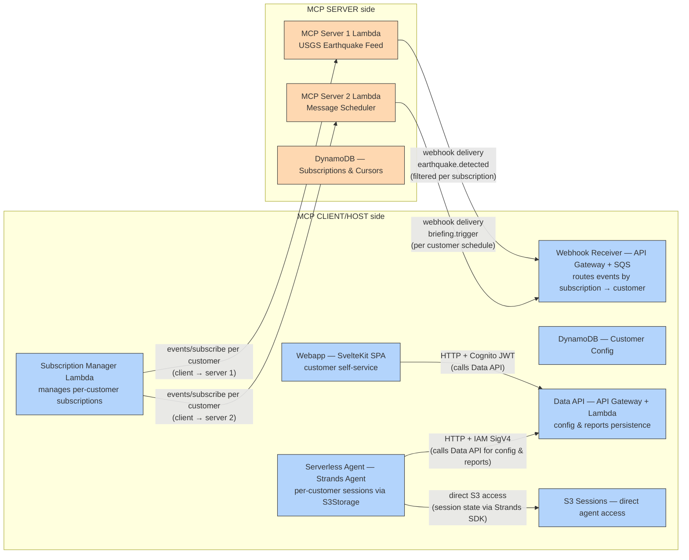

### Sequence Diagram: Earthquake Event Flow (Multi-Customer)

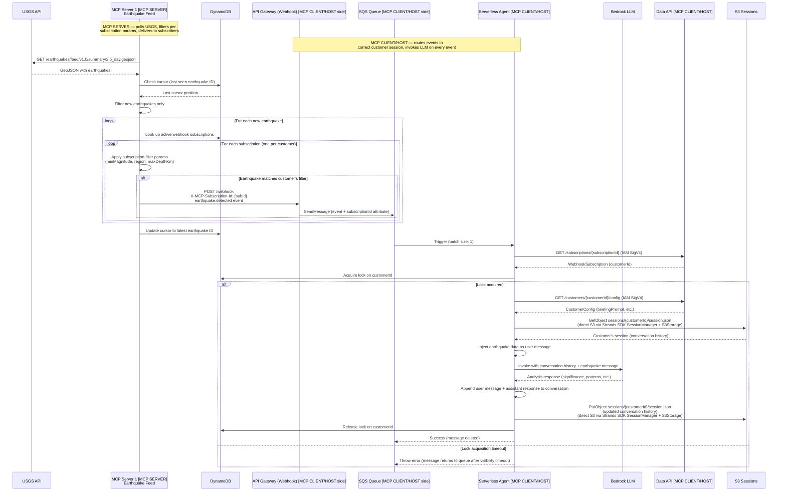

### Sequence Diagram: Briefing Trigger Flow (Multi-Customer)

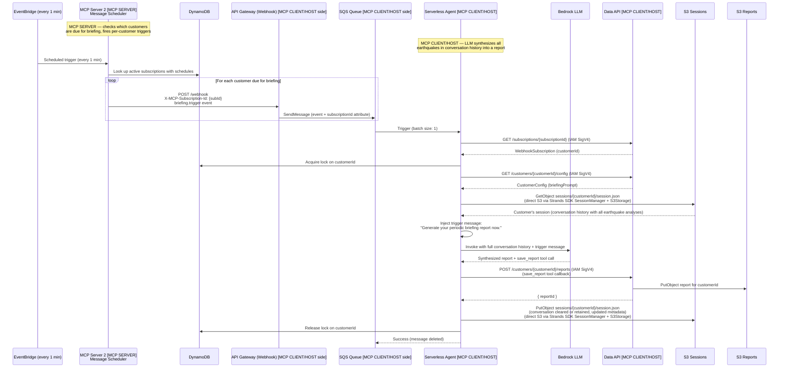

### Sequence Diagram: Subscription Refresh (Per-Customer)

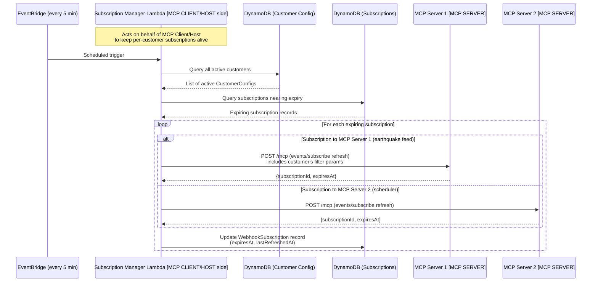

### Sequence Diagram: Customer Registration

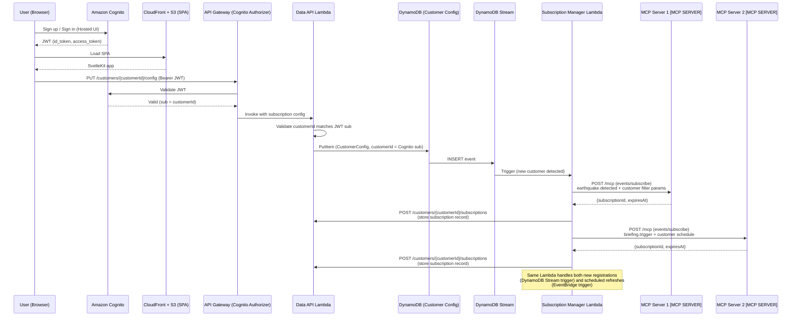

## Components and Interfaces

### Component 1: MCP Server 1 — USGS Earthquake Feed (Lambda) — `MCP SERVER`

**Purpose**: Polls the USGS earthquake API on a schedule, detects new earthquakes using cursor tracking, and delivers each new earthquake as an MCP event via webhook. Filters earthquakes per subscription based on customer-specific parameters (minMagnitude, region, maxDepthKm) defined in the subscription's `inputSchema`.

**MCP Protocol Role**: This is an **MCP Server**. It declares the `earthquake.detected` event type with an `inputSchema` that accepts filter parameters, manages per-customer webhook subscriptions, and delivers filtered events to subscribers using Standard Webhooks signatures.

**Interface**:

```typescript
// MCP Server capabilities declaration
interface McpServer1Capabilities {
  events: {
    subscribe: true;
    listChanged: true;
  };
}

// Event types declared by this server
interface EarthquakeEventType {
  name: "earthquake.detected";
  description: "Emitted when a new earthquake is detected matching subscription filters";
  inputSchema: {
    type: "object";
    properties: {
      minMagnitude: {
        type: "number";
        description: "Only deliver earthquakes >= this magnitude";
      };
      region: {
        type: "string";
        description: "Geographic region filter (pacific, americas, europe, asia, africa)";
      };
      maxDepthKm: {
        type: "number";
        description: "Only deliver earthquakes shallower than this depth";
      };
    };
  };
}
```

// MCP protocol methods handled
interface McpServer1Methods {
"events/list": () => { eventTypes: [EarthquakeEventType] };
"events/subscribe": (params: SubscribeParams) => SubscribeResult;
"events/unsubscribe": (params: { subscriptionId: string }) => void;
}

```

**Responsibilities**:

- Poll USGS GeoJSON feed on EventBridge schedule (every 5 minutes)
- Track cursor (last seen earthquake ID) in DynamoDB to avoid duplicates
- For each new earthquake, iterate over active subscriptions and apply per-subscription filter params
- Only deliver earthquakes that match a subscription's `inputSchema` params (minMagnitude, region, maxDepthKm)
- Include `X-MCP-Subscription-Id` header in webhook deliveries for customer routing
- Deliver events via HTTP POST with Standard Webhooks HMAC signatures
- Manage webhook subscriptions (create, refresh, expire)
- Store subscriptions and cursor state in DynamoDB

---

```

### Component 2: MCP Server 2 — Message Scheduler (Lambda) — `MCP SERVER`

**Purpose**: Emits time-based trigger events via webhook on per-customer schedules. Each customer has their own subscription with their own cron schedule. The scheduler checks which customers are due for a briefing trigger and fires events only for those customers. Can also be triggered manually for a specific customer for demo purposes.

**MCP Protocol Role**: This is an **MCP Server**. It declares the `briefing.trigger` event type, manages per-customer webhook subscriptions (each with its own schedule), and delivers trigger events to subscribers using Standard Webhooks signatures. It does not expose any tools.

**Interface**:

```typescript
// MCP Server capabilities declaration
interface McpServer2Capabilities {
  events: {
    subscribe: true;
    listChanged: true;
  };
}

// Event types declared by this server
interface BriefingTriggerEventType {
  name: "briefing.trigger";
  description: "Emitted per customer schedule to trigger earthquake briefing generation";
  inputSchema: {
    type: "object";
    properties: {
      schedule: {
        type: "string";
        description: "Cron expression for this customer's briefing schedule";
      };
    };
  };
}

// MCP protocol methods handled
interface McpServer2Methods {
  "events/list": () => { eventTypes: [BriefingTriggerEventType] };
  "events/subscribe": (params: SubscribeParams) => SubscribeResult;
  "events/unsubscribe": (params: { subscriptionId: string }) => void;
}

// Manual trigger endpoint (non-MCP, REST) — now per-customer
interface ManualTriggerEndpoint {
  POST: (params: { customerId: string; reason?: string }) => {
    eventId: string;
    delivered: boolean;
  };
}
```

**Responsibilities**:

- Run on a frequent schedule (every 1 minute) to check which customers are due for a briefing
- Evaluate each subscription's cron schedule against current time
- Emit `briefing.trigger` event only for customers whose schedule matches
- Support manual trigger via REST endpoint (`POST /trigger-briefing/:customerId`)
- Include `X-MCP-Subscription-Id` header in webhook deliveries for customer routing
- Manage per-customer webhook subscriptions (create, refresh, expire)
- Store subscriptions in DynamoDB
- Deliver events via HTTP POST with Standard Webhooks HMAC signatures

---

### Component 3: Webhook Receiver (API Gateway + SQS) — `MCP CLIENT/HOST side`

**Purpose**: Receives webhook deliveries from both MCP servers, validates Standard Webhooks signatures, extracts the `X-MCP-Subscription-Id` header for customer routing, and buffers events in SQS with the subscription ID as a message attribute for reliable processing by the agent Lambda.

**MCP Protocol Role**: This component acts on behalf of the **MCP Client/Host**. It is the webhook callback endpoint that both MCP Servers deliver events to. It receives events destined for the client, extracts routing information (subscription ID → customer), and buffers them for the Serverless Agent to process.

**Interface**:

```typescript
// API Gateway webhook endpoint
interface WebhookEndpoint {
  POST: (
    headers: StandardWebhooksHeaders & McpSubscriptionHeaders,
    body: McpEventPayload,
  ) => { statusCode: 200 | 400 | 401 };
}

// Standard Webhooks headers
interface StandardWebhooksHeaders {
  "webhook-id": string;
  "webhook-timestamp": string;
  "webhook-signature": string;
}

// MCP subscription routing header
interface McpSubscriptionHeaders {
  "X-MCP-Subscription-Id": string; // Used to route event to correct customer
}
```

**Responsibilities**:

- Validate Standard Webhooks HMAC-SHA256 signatures (supports secrets from both servers)
- Reject replayed or expired webhook deliveries (timestamp tolerance)
- Extract `X-MCP-Subscription-Id` header from incoming webhooks
- Enqueue validated events to SQS with `subscriptionId` as a message attribute
- Return 200 quickly to avoid webhook timeout/retry

---

### Component 4: Serverless Agent (Strands Agent) — `MCP CLIENT/HOST`

**Purpose**: Runs the Strands Agent that processes MCP events from both servers. Triggered by SQS, looks up the customer from the subscription ID, restores the customer's session directly from S3 using the Strands SDK `SessionManager` with `S3Storage`, calls the LLM on every event, and persists the updated conversation history. The **conversation history is the accumulator** — there is no separate data structure for accumulated earthquakes. When earthquake events arrive, the LLM analyzes them in context of prior conversation. When briefing triggers arrive, the LLM synthesizes everything in its conversation history into a report and calls the `save_report` tool.

**MCP Protocol Role**: This is the **MCP Client/Host**. It runs the Strands Agent which subscribes to events from both MCP Servers and processes them. The Serverless Agent, Webhook Receiver, and Subscription Manager together form the complete MCP Client/Host.

**Interface**:

```typescript
import { Agent } from "@strands-agents/sdk";
import { SessionManager, S3Storage } from "@strands-agents/sdk";
import { tool } from "@strands-agents/sdk";
import { z } from "zod";

// Lambda handler
interface AgentHandler {
  handler: (event: SQSEvent) => Promise<SQSBatchResponse>;
}

// Agent configuration — created per-customer
interface AgentConfig {
  systemPrompt: string; // Customer's briefingPrompt — guides both earthquake analysis and report generation
  tools: [typeof saveReport]; // Single tool: save_report
  sessionManager: SessionManager; // Configured with S3Storage, sessionId = customerId
  model: BedrockModel;
}

// The agent's single tool
const saveReport = tool({
  name: "save_report",
  description:
    "Save the generated earthquake briefing report. Call this when generating a periodic briefing.",
  inputSchema: z.object({
    summary: z.string().describe("High-level summary of seismic activity"),
    notableQuakes: z
      .array(
        z.object({
          earthquakeId: z.string(),
          magnitude: z.number(),
          place: z.string(),
          reason: z.string().describe("Why this quake is notable"),
        }),
      )
      .describe("Significant earthquakes to highlight"),
    geographicPatterns: z
      .string()
      .describe("Analysis of geographic clustering"),
    comparisonToPrevious: z
      .string()
      .describe("How this period compares to the last"),
  }),
  callback: async (input) => {
    // Writes report to S3 via Data API
    // Returns confirmation with report ID
  },
});

// Session management — direct S3 access via Strands SDK
interface AgentSessionConfig {
  storage: S3Storage; // Strands SDK S3Storage pointing to sessions bucket
  sessionId: string; // = customerId (ensures per-customer isolation)
  // S3 path: sessions/{customerId}/session.json
}

// Customer routing from SQS message
interface CustomerRouting {
  resolveCustomer: (sqsMessage: SQSRecord) => Promise<{
    customerId: string;
    config: CustomerConfig;
  }>;
}

// Distributed lock for session write serialization (direct DynamoDB access)
interface CustomerSessionLockManager {
  acquireLock: (
    customerId: string,
    ownerId: string, // Lambda request ID
    ttlSeconds?: number, // Default: 60
    timeoutMs?: number, // Max wait time, default: 10000
  ) => Promise<{ acquired: boolean; lockKey: string }>;
  releaseLock: (
    customerId: string,
    ownerId: string, // Must match the owner who acquired
  ) => Promise<void>;
}

// Data API client (HTTP calls with IAM SigV4 signing)
// Note: Session state is NOT accessed via Data API — agent uses S3Storage directly
interface DataApiClient {
  getSubscription: (subscriptionId: string) => Promise<WebhookSubscription>;
  getConfig: (customerId: string) => Promise<CustomerConfig>;
}
```

**Processing Model — Conversation History as Accumulator**:

1. **On earthquake event**: The earthquake data is injected as a user message into the agent's conversation. The LLM is invoked and responds with a brief summary/analysis of the earthquake (significance, patterns relative to previous quakes in the conversation, etc.). Both the user message and assistant response are persisted in the session's conversation history via the Strands SDK `SessionManager`.

2. **On briefing trigger**: The agent already has all earthquake observations in its conversation history. The LLM is invoked with a message like "Generate your periodic briefing report now." The agent synthesizes everything in its context into a report and calls the `save_report` tool to persist it.

**Responsibilities**:

- Parse MCP event from SQS message body
- Extract `subscriptionId` from SQS message attributes
- Call Data API (`GET /subscriptions/{subscriptionId}`) to resolve `customerId` (IAM SigV4 auth)
- **Acquire distributed lock on customer ID** before reading session state (direct DynamoDB access — own lock table)
- Call Data API (`GET /customers/{customerId}/config`) to load CustomerConfig (IAM SigV4 auth)
- Determine event type: `earthquake.detected` or `briefing.trigger`
- **Restore customer's session directly from S3** using Strands SDK `SessionManager` with `S3Storage` (sessionId = customerId, path: `sessions/{customerId}/session.json`)
- For earthquake events: inject earthquake data as a user message → invoke LLM → agent responds with analysis → conversation history grows
- For briefing triggers: inject trigger message ("Generate your periodic briefing report now.") → invoke LLM → agent calls `save_report` tool → report persisted via Data API → conversation history cleared or retained based on strategy
- The agent's system prompt includes the customer's `briefingPrompt` which guides both earthquake analysis and report generation
- **Persist updated session state directly to S3** using Strands SDK `SessionManager` with `S3Storage`
- **Release distributed lock on customer ID** after session state is persisted (direct DynamoDB access)
- Handle partial batch failures (SQS batch response)
- On lock acquisition timeout: throw error to return message to SQS for retry after visibility timeout

**Direct S3 Access (not via Data API)**:

- Session restore/persist via Strands SDK `SessionManager` with `S3Storage` (only the agent reads/writes session state)

**Direct DynamoDB Access (not via Data API)**:

- Distributed lock acquisition/release (latency-sensitive, must be fast) — own dedicated DynamoDB table

---

### Component 5: Subscription Manager (Lambda) — `MCP CLIENT/HOST side`

**Purpose**: Manages the full lifecycle of webhook subscriptions for all customers. Triggered by two sources: (1) DynamoDB Stream on CustomerConfig table for creating new subscriptions when a customer registers, and (2) EventBridge schedule for refreshing existing subscriptions before TTL expires. This single Lambda handles both registration and maintenance, eliminating the need for a separate Registration Handler.

**MCP Protocol Role**: Acts on behalf of the **MCP Client/Host**. It calls both MCP Servers' `events/subscribe` methods to create and refresh per-customer subscriptions, which is a client-side responsibility. In a traditional long-running MCP client, this would happen within the client process itself — here it's separated into its own Lambda because the client (Serverless Agent) is serverless and only runs when triggered by events.

**Triggers**:

- **DynamoDB Stream** (Customer Config table): INSERT/MODIFY events → create or update subscriptions for new/changed customers
- **EventBridge Rule** (every 5 min): scheduled refresh of expiring subscriptions

**Interface**:

```typescript
// Dual-trigger handler
interface SubscriptionManagerHandler {
  handler: (event: DynamoDBStreamEvent | EventBridgeEvent) => Promise<void>;
}

// Registration logic (triggered by DynamoDB Stream)
interface CustomerRegistrar {
  registerCustomer: (config: CustomerConfig) => Promise<RegistrationResult>;
}

interface RegistrationResult {
  customerId: string;
  subscriptions: {
    server1: { subscriptionId: string; expiresAt: string };
    server2: { subscriptionId: string; expiresAt: string };
  };
}

// Subscription refresh logic (triggered by EventBridge schedule)
interface SubscriptionRefresher {
  refreshExpiring(thresholdMinutes: number): Promise<RefreshResult[]>;
  refreshForCustomer(customerId: string): Promise<RefreshResult[]>;
}

interface RefreshResult {
  subscriptionId: string;
  customerId: string;
  serverEndpoint: string;
  newExpiresAt: string;
  success: boolean;
}
```

**Responsibilities**:

- **On DynamoDB Stream trigger (new/updated customer)**:
  - Extract the new/updated `CustomerConfig` from the stream record
  - Call MCP Server 1's `events/subscribe` with customer's filter params (minMagnitude, region, maxDepthKm)
  - Call MCP Server 2's `events/subscribe` with customer's briefing schedule
  - Store `WebhookSubscription` records via the Data API
  - Handle partial failures (one server succeeds, other fails) — retry failed server
  - Idempotent: check if subscriptions already exist before creating duplicates

- **On EventBridge schedule trigger (refresh)**:
  - Query Data API for all active customers and their subscriptions
  - Identify subscriptions expiring within threshold
  - Call each MCP server's `events/subscribe` to refresh the relevant subscriptions
  - Include customer-specific filter params when refreshing Server 1 subscriptions
  - Update subscription records via the Data API with new `expiresAt` and `lastRefreshedAt`
  - Detect and re-create missing subscriptions for active customers

- **Shared responsibilities**:
  - Log failures for alerting (per-customer granularity)
  - Handle server-specific secrets for each MCP server
  - Use `@aws/run-mcp-servers-with-aws-lambda` `StreamableHTTPClientWithSigV4Transport` to connect to MCP server API Gateways with IAM auth:

```typescript
import { StreamableHTTPClientWithSigV4Transport } from "@aws/run-mcp-servers-with-aws-lambda";
import { Client } from "@modelcontextprotocol/sdk/client/index.js";

const client = new Client(
  { name: "subscription-manager", version: "1.0.0" },
  { capabilities: {} },
);

const transport = new StreamableHTTPClientWithSigV4Transport(
  new URL("https://<api-gw-id>.execute-api.<region>.amazonaws.com/prod/mcp"),
  { service: "execute-api", region: "<region>" },
);
await client.connect(transport);
// Now call events/subscribe, events/unsubscribe via the MCP client
```

**Subscription Record Flow Summary**:

1. Customer registers via webapp → Data API writes `CustomerConfig` to DynamoDB
2. DynamoDB Stream fires INSERT event → Subscription Manager Lambda triggers
3. Subscription Manager calls MCP Server 1 `events/subscribe` → receives `subscriptionId`
4. Subscription Manager calls MCP Server 2 `events/subscribe` → receives `subscriptionId`
5. Subscription Manager stores `WebhookSubscription` records via Data API
6. When events arrive, Serverless Agent resolves `subscriptionId → customerId` via Data API
7. Subscription Manager refreshes these records (every 5 min) before they expire

---

---

### Component 6: CDK Infrastructure (Multi-Stack App)

**Purpose**: Defines all AWS resources as infrastructure-as-code using AWS CDK (TypeScript). A single CDK app synthesizes multiple stacks — one per discrete component — each with its own API Gateway and custom domain. Provides a single `cdk deploy --all` experience for the entire multi-customer system.

**Domain Structure**:

The CDK app takes a `parentDomain` parameter (default: `liguori.people.aws.dev`) and creates a subdomain zone `earthquake-agent.<parentDomain>`. Each stack gets its own endpoint under this subdomain:

| Stack                    | Endpoint                                        | Purpose                                           |
| ------------------------ | ----------------------------------------------- | ------------------------------------------------- |
| UsgsServerStack          | `usgs-mcp.earthquake-agent.<parentDomain>`      | MCP Server 1 (USGS feed) API Gateway              |
| SchedulerServerStack     | `scheduler-mcp.earthquake-agent.<parentDomain>` | MCP Server 2 (Message Scheduler) API Gateway      |
| DataApiStack             | `api.earthquake-agent.<parentDomain>`           | Data API (config, subscriptions, reports)         |
| WebhookReceiverStack     | `webhook.earthquake-agent.<parentDomain>`       | Webhook receiver endpoint                         |
| AgentStack               | — (no public endpoint)                          | Serverless Agent Lambda + S3 sessions + DDB locks |
| SubscriptionManagerStack | — (no public endpoint)                          | Subscription Manager Lambda                       |
| WebappStack              | `app.earthquake-agent.<parentDomain>`           | CloudFront + S3 (SvelteKit SPA)                   |
| AuthStack                | `auth.earthquake-agent.<parentDomain>`          | Cognito User Pool + hosted UI                     |

**Interface**:

```typescript
import * as cdk from "aws-cdk-lib";

// Shared props across all stacks
interface SharedProps {
  parentDomain: string; // default: "liguori.people.aws.dev"
  subdomain: string; // default: "earthquake-agent"
  // Resolved at synth time:
  // - Route53 hosted zone lookup for parentDomain
  // - ACM certificate for *.earthquake-agent.<parentDomain>
}

// CDK App entry point
const app = new cdk.App();
const shared: SharedProps = {
  parentDomain:
    app.node.tryGetContext("parentDomain") || "liguori.people.aws.dev",
  subdomain: "earthquake-agent",
};

// Stack instantiation order (dependencies flow top-down)
const auth = new AuthStack(app, "AuthStack", { ...shared });
const dataApi = new DataApiStack(app, "DataApiStack", { ...shared });
const usgsServer = new UsgsServerStack(app, "UsgsServerStack", { ...shared });
const schedulerServer = new SchedulerServerStack(app, "SchedulerServerStack", {
  ...shared,
});
const webhookReceiver = new WebhookReceiverStack(app, "WebhookReceiverStack", {
  ...shared,
});
const agent = new AgentStack(app, "AgentStack", {
  ...shared,
  dataApiUrl: dataApi.url,
});
const subscriptionMgr = new SubscriptionManagerStack(
  app,
  "SubscriptionManagerStack",
  {
    ...shared,
    dataApiUrl: dataApi.url,
    usgsServerUrl: usgsServer.url,
    schedulerServerUrl: schedulerServer.url,
  },
);
const webapp = new WebappStack(app, "WebappStack", {
  ...shared,
  dataApiUrl: dataApi.url,
  cognitoUserPoolId: auth.userPoolId,
  cognitoClientId: auth.clientId,
});
```

**DNS & TLS Setup** (shared across stacks):

- Look up existing Route53 hosted zone for `parentDomain` (already registered)
- Create a new Route53 hosted zone for `earthquake-agent.<parentDomain>`
- Add NS delegation record in parent zone pointing to the new subdomain zone
- Create ACM wildcard certificate for `*.earthquake-agent.<parentDomain>` (DNS validation via Route53)
- Each stack's API Gateway uses a custom domain name with the shared certificate

**Stack Responsibilities**:

- **AuthStack**: Cognito User Pool, User Pool Client, hosted UI domain (`auth.earthquake-agent.<parentDomain>`)
- **DataApiStack**: API Gateway + Lambda for Data API routes (config, subscriptions, reports), DynamoDB tables (Customer Config, Subscriptions), S3 reports bucket, dual auth (Cognito + IAM)
- **UsgsServerStack**: API Gateway (IAM auth) + Lambda for MCP Server 1, DynamoDB (Cursor State, Subscriptions), EventBridge rule (poll every 5 min)
- **SchedulerServerStack**: API Gateway (IAM auth) + Lambda for MCP Server 2, DynamoDB (Subscriptions), EventBridge rule (check every 1 min)
- **WebhookReceiverStack**: API Gateway + Lambda for webhook validation, SQS queue + DLQ
- **AgentStack**: Lambda (Serverless Agent), S3 sessions bucket, DynamoDB session locks table, IAM role with `execute-api:Invoke` on Data API
- **SubscriptionManagerStack**: Lambda with dual triggers (DynamoDB Stream from DataApiStack's Customer Config table + EventBridge schedule), IAM role with `execute-api:Invoke` on MCP server API Gateways and Data API
- **WebappStack**: S3 bucket for static SvelteKit SPA, CloudFront distribution with custom domain (`app.earthquake-agent.<parentDomain>`), OAC

**Cross-Stack References**:

Stacks export/import values via `CfnOutput` / `Fn.importValue`:

- DataApiStack exports: API URL, Customer Config table ARN + stream ARN, Subscriptions table ARN
- AuthStack exports: User Pool ID, User Pool Client ID, hosted UI domain
- UsgsServerStack exports: API URL
- SchedulerServerStack exports: API URL
- WebhookReceiverStack exports: SQS queue ARN, webhook endpoint URL

---

### Component 7: Webapp (Frontend SPA)

**Purpose**: A serverless demo webapp that allows customers to self-service their earthquake monitoring subscriptions. Customers sign up via Cognito, configure their subscription parameters and briefing prompt, view generated reports, and manually trigger briefings. The frontend calls the shared Data API directly — no dedicated webapp backend Lambdas needed.

**Interface**:

```typescript
// Frontend: SvelteKit SPA (static adapter) served from S3 via CloudFront
// Styling: shadcn-svelte (Tailwind-based component library)
// Auth: Amazon Cognito User Pool with Hosted UI (sign-up, sign-in, password reset)
// Backend: Calls the shared Data API (API Gateway with Cognito User Pool Authorizer)

// Data API routes called by the webapp (all require valid Cognito JWT in Authorization header)
interface WebappDataApiCalls {
  // Customer config management
  "GET /customers/:customerId/config": () => CustomerConfig | null;
  "PUT /customers/:customerId/config": (
    body: SubscriptionInput,
  ) => CustomerConfig;
  "DELETE /customers/:customerId/config": () => { deactivated: boolean };

  // Reports
  "GET /customers/:customerId/reports": () => { reports: ReportSummary[] };
  "GET /customers/:customerId/reports/:reportId": () => BriefingReport;

  // Manual trigger (separate route on same API Gateway)
  "POST /trigger-briefing/:customerId": () => {
    triggered: boolean;
    eventId: string;
  };
}

// Input for creating/updating a subscription
interface SubscriptionInput {
  displayName: string;
  subscriptionParams: {
    minMagnitude?: number;
    region?: string;
    maxDepthKm?: number;
  };
  briefingPrompt: string;
  briefingSchedule: string; // Cron expression
}

// Report list item (lightweight, no full content)
interface ReportSummary {
  reportId: string;
  generatedAt: string;
  periodStart: string;
  periodEnd: string;
  totalEarthquakes: number;
  summary: string; // First 200 chars of the summary
}

// Cognito identity mapping
// customerId = Cognito User Pool "sub" claim (UUID)
// This ties auth identity → subscription → session → reports
```

**Responsibilities**:

- **Frontend (SvelteKit SPA with shadcn-svelte)**:
  - Serve static assets from S3 via CloudFront (SvelteKit built as static adapter)
  - Implement Cognito Hosted UI redirect flow for sign-up/sign-in
  - Store JWT tokens in memory (not localStorage for security)
  - Provide UI for subscription configuration (filter params, briefing prompt, schedule)
  - Display list of generated reports with ability to read full content
  - Provide "Trigger Briefing Now" button for manual triggers
  - Minimal UI — demo quality, not production polish
  - Uses shadcn-svelte components (Button, Card, Table, Form, Input, Select) for polished look
  - Calls the shared Data API directly with Cognito JWT in Authorization header
  - Uses `customerId` derived from JWT `sub` claim in all API paths

- **No dedicated backend Lambdas**: The webapp frontend calls the Data API (Component 8) directly. The Data API handles all persistence operations (config CRUD, report reads, session state). The only webapp-specific route is `POST /trigger-briefing/:customerId` which invokes MCP Server 2's manual trigger endpoint.

---

### Component 8: Data API (API Gateway + Lambda) — `MCP CLIENT/HOST side`

**Purpose**: A shared persistence layer that encapsulates all S3 and DynamoDB operations for customer config and reports. Both the webapp (via Cognito JWT) and the Serverless Agent (via IAM SigV4) call this API via HTTP. Session state is NOT managed by the Data API — the Serverless Agent accesses its session bucket directly via the Strands SDK `SessionManager` with `S3Storage`. Provides a single source of truth for config and report access logic, validation, and authorization.

**Interface**:

```typescript
// Data API routes — served by a single Lambda behind API Gateway
// Supports dual authorization: Cognito User Pool Authorizer (webapp) + IAM Authorizer (agent)
// Note: Session state routes are NOT included — agent accesses S3 sessions directly
interface DataApiRoutes {
  // Customer config
  "GET /customers/:customerId/config": () => CustomerConfig | null;
  "PUT /customers/:customerId/config": (
    body: CustomerConfigInput,
  ) => CustomerConfig;
  "DELETE /customers/:customerId/config": () => { deactivated: boolean };

  // Subscriptions
  "GET /subscriptions/:subscriptionId": () => WebhookSubscription;
  "GET /customers/:customerId/subscriptions": () => {
    subscriptions: WebhookSubscription[];
  };
  "POST /customers/:customerId/subscriptions": (body: WebhookSubscription) => {
    subscriptionId: string;
  };
  "PUT /subscriptions/:subscriptionId": (
    body: Partial<WebhookSubscription>,
  ) => WebhookSubscription;

  // Reports
  "GET /customers/:customerId/reports": (query?: { latest?: boolean }) => {
    reports: ReportSummary[];
  };
  "GET /customers/:customerId/reports/:reportId": () => BriefingReport;
  "POST /customers/:customerId/reports": (body: BriefingReport) => {
    reportId: string;
  };
}

// Authorization context passed to the Lambda handler
interface AuthContext {
  // For Cognito-authorized requests:
  cognitoSub?: string; // JWT "sub" claim = customerId
  // For IAM-authorized requests:
  iamArn?: string; // Caller's IAM role ARN (Serverless Agent role)
  authType: "cognito" | "iam";
}

// Input for creating/updating customer config
interface CustomerConfigInput {
  displayName: string;
  subscriptionParams: {
    minMagnitude?: number;
    region?: string;
    maxDepthKm?: number;
  };
  briefingPrompt: string;
  briefingSchedule: string; // Cron expression
}
```

**Responsibilities**:

- **Authorization enforcement**:
  - For Cognito-authorized requests (webapp): validate that `customerId` in the URL path matches the JWT `sub` claim. Reject with 403 if mismatch.
  - For IAM-authorized requests (Serverless Agent): allow access to any customer's data (the agent processes events for all customers). The IAM role is restricted to the Serverless Agent's execution role via resource policy.
- **Config operations**:
  - `GET /customers/:customerId/config`: Read CustomerConfig from DynamoDB
  - `PUT /customers/:customerId/config`: Validate input, write/update CustomerConfig in DynamoDB (triggers DynamoDB Stream → Registration Handler for new customers)
  - `DELETE /customers/:customerId/config`: Set `active: false` on CustomerConfig (Subscription Manager will clean up subscriptions)
- **Subscription operations**:
  - `GET /subscriptions/:subscriptionId`: Look up a subscription by ID (used by Serverless Agent to resolve subscriptionId → customerId)
  - `GET /customers/:customerId/subscriptions`: List all subscriptions for a customer
  - `POST /customers/:customerId/subscriptions`: Create a new subscription record (used by Registration Handler)
  - `PUT /subscriptions/:subscriptionId`: Update subscription fields like `expiresAt`, `lastRefreshedAt` (used by Subscription Manager)
- **Report operations**:
  - `GET /customers/:customerId/reports`: List objects in S3 at `reports/{customerId}/` prefix, return metadata. Supports `?latest=true` query param to return only the most recent report.
  - `GET /customers/:customerId/reports/:reportId`: Read specific report JSON from S3 at `reports/{customerId}/{reportId}.json`
  - `POST /customers/:customerId/reports`: Write a new report to S3 at `reports/{customerId}/{reportId}.json` (used by Serverless Agent)
- **Input validation**: Validate all request bodies against schemas (zod). Reject malformed requests with 400.
- **Error responses**: Return appropriate HTTP status codes (400 for validation errors, 403 for auth failures, 404 for not found, 500 for internal errors)

**API Gateway Configuration**:

The Data API routes support **two authorizers** on the same routes:

- **Cognito User Pool Authorizer**: For webapp requests. JWT in `Authorization: Bearer <token>` header. API Gateway validates the token and passes claims to the Lambda.
- **IAM Authorizer**: For Serverless Agent requests. SigV4-signed requests. The Serverless Agent's IAM role is granted `execute-api:Invoke` permission on the Data API resource ARN.

API Gateway uses request context to distinguish the auth type and passes it to the Lambda handler via `event.requestContext.authorizer`.

---

## Data Models

### Model 1: Customer Configuration

```typescript
/**
 * Stored in DynamoDB. Defines a customer's subscription parameters,
 * briefing preferences, and schedule. Each customer gets independent
 * subscriptions to both MCP servers.
 *
 * customerId = Cognito User Pool "sub" claim (UUID).
 * This ties the authenticated identity to the subscription, session, and reports.
 */
interface CustomerConfig {
  customerId: string; // Primary key — Cognito user "sub" (UUID)
  displayName: string; // Human-readable name (set by user in webapp)
  subscriptionParams: {
    minMagnitude?: number; // Filter: only earthquakes >= this magnitude (default: 2.5)
    region?: string; // Filter: geographic region (e.g., "pacific", "americas", "europe")
    maxDepthKm?: number; // Filter: only earthquakes shallower than this
  };
  briefingPrompt: string; // Custom system prompt for briefing generation
  briefingSchedule: string; // Cron expression for this customer's briefing trigger
  active: boolean; // Whether this customer's subscriptions are active
  createdAt: string; // ISO 8601
  updatedAt: string; // ISO 8601
}
```

**Validation Rules**:

- `customerId` is a Cognito User Pool "sub" (UUID v4 format, e.g., "a1b2c3d4-e5f6-7890-abcd-ef1234567890")
- `subscriptionParams.minMagnitude` must be >= 0 and <= 10 (default: 2.5)
- `subscriptionParams.region` must be one of: "pacific", "americas", "europe", "asia", "africa", or undefined (global)
- `subscriptionParams.maxDepthKm` must be > 0 if specified
- `briefingPrompt` must be non-empty, max 2000 characters
- `briefingSchedule` must be a valid cron expression
- `active` defaults to `true` on creation

---

### Model 2: MCP Event Payload

```typescript
/**
 * The event payload delivered via webhook.
 * Follows the MCP Events extension specification.
 * Used by both MCP servers.
 */
interface McpEventPayload {
  eventId: string; // Unique event identifier (UUID v4)
  name: string; // Event type: "earthquake.detected" or "briefing.trigger"
  timestamp: string; // ISO 8601 timestamp
  data: EarthquakeDetectedData | BriefingTriggerData;
  cursor: string; // Opaque cursor for ordering/resumption
}
```

**Validation Rules**:

- `eventId` must be a valid UUID v4
- `name` must be either `earthquake.detected` or `briefing.trigger`
- `timestamp` must be valid ISO 8601, not in the future
- `cursor` is opaque but must be monotonically increasing per event type

---

### Model 3: Earthquake Detected Event Data

```typescript
/**
 * Event data payload for earthquake.detected events.
 * Derived from USGS GeoJSON feature properties.
 */
interface EarthquakeDetectedData {
  earthquakeId: string; // USGS earthquake ID (e.g., "us7000n123")
  magnitude: number; // Richter magnitude (≥ 2.5)
  place: string; // Human-readable location (e.g., "10km SW of Ridgecrest, CA")
  coordinates: {
    longitude: number; // Decimal degrees
    latitude: number; // Decimal degrees
    depth: number; // Kilometers below surface
  };
  time: string; // ISO 8601 timestamp of earthquake occurrence
  tsunami: boolean; // Whether a tsunami warning was issued
  felt: number | null; // Number of "felt" reports, if any
  alert: "green" | "yellow" | "orange" | "red" | null; // PAGER alert level
  url: string; // USGS event page URL
}
```

**Validation Rules**:

- `magnitude` must be ≥ 2.5 (base filter threshold)
- `coordinates.depth` must be ≥ 0
- `coordinates.longitude` must be between -180 and 180
- `coordinates.latitude` must be between -90 and 90
- `time` must be valid ISO 8601 and not in the future

---

### Model 4: Briefing Trigger Event Data

```typescript
/**
 * Event data payload for briefing.trigger events.
 * Now includes customerId for routing.
 */
interface BriefingTriggerData {
  triggerType: "scheduled" | "manual"; // How the trigger was initiated
  customerId: string; // Which customer this trigger is for
  reason?: string; // Optional reason (for manual triggers)
  scheduledTime: string; // ISO 8601 — when this trigger was scheduled for
}
```

**Validation Rules**:

- `triggerType` must be either `scheduled` or `manual`
- `customerId` must reference an existing active customer
- `scheduledTime` must be valid ISO 8601

---

### Model 5: Customer Session Lock

```typescript
/**
 * Stored in DynamoDB lock table. Implements distributed pessimistic locking
 * to prevent concurrent writes to a customer's session data.
 * Uses conditional PutItem for acquisition and TTL for auto-cleanup of crashed holders.
 */
interface CustomerSessionLock {
  lockKey: string; // Primary key: "lock#{customerId}"
  ownerId: string; // Lambda request ID (unique per invocation)
  acquiredAt: string; // ISO 8601
  expiresAt: number; // DynamoDB TTL (epoch seconds) — auto-cleanup for crashed holders
  ttlSeconds: number; // Lock duration (e.g., 60 seconds)
}
```

**Validation Rules**:

- `lockKey` must follow format `lock#{customerId}` where `customerId` is a valid customer ID
- `ownerId` must be a valid Lambda request ID (unique per invocation, used for safe release)
- `expiresAt` must be `acquiredAt` + `ttlSeconds` expressed as epoch seconds
- `ttlSeconds` default: 60 seconds (sufficient for session read + process + write)
- Lock acquisition uses `ConditionExpression: attribute_not_exists(lockKey) OR expiresAt < :now`
- Lock release uses `ConditionExpression: ownerId = :myOwnerId` (only the holder can release)

---

### Model 6: Webhook Subscription

```typescript
/**
 * Stored in DynamoDB. Represents an active webhook subscription.
 * Each customer has their own subscriptions to both MCP servers.
 */
interface WebhookSubscription {
  subscriptionId: string; // Primary key (UUID v4)
  customerId: string; // GSI: which customer owns this subscription
  serverEndpoint: string; // Which MCP server (Server 1 or Server 2 URL)
  eventName: string; // Event type subscribed to
  callbackUrl: string; // Webhook delivery URL
  hmacSecret: string; // Shared secret for Standard Webhooks signatures
  filterParams?: {
    // Customer-specific filter params (for Server 1)
    minMagnitude?: number;
    region?: string;
    maxDepthKm?: number;
  };
  schedule?: string; // Customer's cron schedule (for Server 2)
  createdAt: string; // ISO 8601
  expiresAt: string; // ISO 8601 TTL
  lastRefreshedAt: string; // ISO 8601
  status: "active" | "expired" | "failed";
}
```

**Validation Rules**:

- `callbackUrl` must be HTTPS
- `hmacSecret` minimum 32 characters
- `expiresAt` must be in the future at creation time
- TTL default: 30 minutes (configurable)
- `serverEndpoint` must reference a known MCP server
- `customerId` must reference an existing customer in CustomerConfig table
- Each customer should have exactly 2 active subscriptions (one per server)

---

### Model 7: Agent Session State

```typescript
/**
 * Persisted to S3 by the Strands SDK SessionManager.
 * Each customer has their own session at sessions/{customerId}/session.json.
 * The SDK handles serialization; this shows the logical structure.
 *
 * KEY DESIGN DECISION: The conversation history IS the accumulated data.
 * There is no separate accumulatedEarthquakes array. Each earthquake event
 * becomes a user message (earthquake data) + assistant message (LLM analysis).
 * When a briefing is triggered, the LLM has full context of all prior
 * earthquakes in the conversation and synthesizes them into a report.
 */
interface AgentSessionState {
  sessionId: string; // = customerId (ensures per-customer isolation)
  customerId: string; // Redundant but explicit for clarity
  messages: ConversationMessage[]; // Full conversation history — this IS the accumulated earthquake data
  metadata: {
    lastEventId: string; // Last processed event cursor
    lastActiveAt: string; // ISO 8601
    invocationCount: number;
    lastBriefingAt: string | null; // ISO 8601 — when last briefing was generated
    customerDisplayName: string; // Cached from config
  };
}

interface ConversationMessage {
  role: "user" | "assistant" | "tool";
  content: string | ToolUseContent[];
  timestamp: string;
}
```

**Validation Rules**:

- `sessionId` equals `customerId` (deterministic, one session per customer)
- Session size should be bounded (trim oldest messages if exceeding context window limits)
- `lastEventId` used for idempotency checks
- The Strands SDK `SessionManager` handles serialization — the conversation history IS the accumulated data
- After briefing generation, conversation may be cleared or retained based on context window strategy
- Sessions are completely isolated — no cross-customer data leakage

---

### Model 8: Briefing Report

```typescript
/**
 * The output artifact written to S3 when a briefing is generated.
 * Stored at reports/{customerId}/{reportId}.json.
 *
 * Note: There is no rawData field. The raw earthquake data lives in the
 * agent's conversation history, not in the report. The report is the
 * LLM's synthesized output from the save_report tool call.
 */
interface BriefingReport {
  reportId: string; // UUID v4
  customerId: string; // Which customer this report belongs to
  customerDisplayName: string; // Human-readable customer name
  briefingPrompt: string; // The prompt used to generate this report
  generatedAt: string; // ISO 8601
  periodStart: string; // ISO 8601 — start of reporting period
  periodEnd: string; // ISO 8601 — end of reporting period
  summary: string; // High-level summary of seismic activity
  totalEarthquakes: number;
  notableQuakes: NotableQuake[]; // Significant earthquakes highlighted
  geographicPatterns: string; // Analysis of geographic clustering
  comparisonToPrevious: string; // How this period compares to the last
}

interface NotableQuake {
  earthquakeId: string;
  magnitude: number;
  place: string;
  reason: string; // Why it's notable (largest, deepest, near population, etc.)
}
```

**Validation Rules**:

- `periodStart` must be before `periodEnd`
- `notableQuakes` entries should reference earthquakes the agent observed in conversation
- `customerId` must match the S3 path prefix

---

### Model 9: Subscribe Request/Response (MCP Protocol)

```typescript
/**
 * MCP events/subscribe request parameters.
 * Now includes per-customer filter params in inputSchema.
 */
interface SubscribeParams {
  event: string; // "earthquake.detected" or "briefing.trigger"
  delivery: {
    mode: "webhook";
    url: string; // Callback URL for delivery
    secret: string; // HMAC secret for signing
  };
  inputSchema?: {
    // Per-customer filter params
    minMagnitude?: number; // For earthquake.detected subscriptions
    region?: string; // For earthquake.detected subscriptions
    maxDepthKm?: number; // For earthquake.detected subscriptions
    schedule?: string; // For briefing.trigger subscriptions (cron)
  };
  ttl?: number; // Subscription TTL in seconds (default: 1800)
}

/**
 * MCP events/subscribe response
 */
interface SubscribeResult {
  subscriptionId: string;
  expiresAt: string; // ISO 8601
}
```

---

### Model 10: USGS Cursor State

```typescript
/**
 * Stored in DynamoDB by MCP Server 1.
 * Tracks which earthquakes have already been emitted as events.
 * Shared across all customers (filtering happens per-subscription at delivery time).
 */
interface UsgsCursorState {
  cursorId: string; // Primary key (fixed value, e.g., "usgs-2.5-day")
  lastSeenIds: string[]; // Set of earthquake IDs from last poll
  lastPollAt: string; // ISO 8601
  lastEmittedAt: string; // ISO 8601 — when last event was emitted
  totalEmitted: number; // Running count of emitted events
}
```

**Validation Rules**:

- `lastSeenIds` bounded to last 200 entries (rolling window)
- `lastPollAt` must be within expected polling interval

## Correctness Properties

_A property is a characteristic or behavior that should hold true across all valid executions of a system — essentially, a formal statement about what the system should do. Properties serve as the bridge between human-readable specifications and machine-verifiable correctness guarantees._

### Property 1: Webhook Signature Round-Trip

_For any_ event payload and HMAC secret, signing the payload with the secret and then verifying the resulting signature against the same payload and secret SHALL return true. Conversely, _for any_ payload signed with secret A, verifying with a different secret B (where A ≠ B) SHALL return false.

**Validates: Requirements 3.1, 3.2, 14.5, 17.1**

### Property 2: Replay Attack Rejection

_For any_ webhook delivery with a timestamp more than 5 minutes from the current time, the Webhook Receiver SHALL reject the delivery regardless of signature validity.

**Validates: Requirement 3.3**

### Property 3: Earthquake Deduplication (Cursor Integrity)

_For any_ sequence of USGS poll cycles with overlapping earthquake IDs, MCP Server 1 SHALL emit each earthquake at most once per subscription. After each poll cycle, the cursor state SHALL contain all previously emitted earthquake IDs, and only earthquakes not in the cursor SHALL be emitted.

**Validates: Requirements 1.1, 1.4, 1.6**

### Property 4: Per-Customer Earthquake Filtering

_For any_ earthquake `q` and subscription `s` with filter parameters, MCP Server 1 SHALL deliver `q` to `s` if and only if: `q.magnitude >= s.filterParams.minMagnitude` AND (if `s.filterParams.region` is set, `q` is within that region) AND (if `s.filterParams.maxDepthKm` is set, `q.coordinates.depth <= s.filterParams.maxDepthKm`). When no filter parameters are set, all earthquakes SHALL be delivered.

**Validates: Requirements 1.2, 1.5, 12.1, 12.2, 12.3, 12.4**

### Property 5: Conversation History Integrity

_For any_ sequence of `earthquake.detected` events processed for customer `C`, the customer's session conversation history SHALL contain a user message (earthquake data) and assistant message (LLM analysis) for each processed event, in chronological order. The conversation history SHALL be the sole accumulator of earthquake observations. After processing a `briefing.trigger` event, `lastBriefingAt` SHALL be updated, and the conversation may be cleared based on context window management strategy.

**Validates: Requirements 4.4, 4.6**

### Property 6: Idempotent Event Processing

_For any_ event processed twice for the same customer (same `eventId`), the session state after the second processing SHALL be identical to the state after the first processing. No duplicate earthquake messages SHALL appear in the conversation history, and no duplicate briefing reports SHALL be generated.

**Validates: Requirements 7.1, 7.2, 7.3**

### Property 7: Customer Isolation

_For any_ event `e` with subscription mapping to customer `C_a`, the only session file read or written during processing SHALL be `sessions/{C_a}/session.json`. No other customer's session SHALL be accessed, and no earthquakes from customer `C_a`'s session SHALL appear in any other customer's briefing report.

**Validates: Requirements 5.1, 5.2**

### Property 8: Session Write Serialization (Mutual Exclusion)

_For any_ customer `C`, at most one Lambda invocation SHALL hold the distributed lock at any given time. If invocation `I_1` holds the lock for `C` during interval `[t_1, t_2]`, no other invocation SHALL acquire the lock for `C` during that interval. Locks with expired TTL SHALL be acquirable by new owners, and only the lock owner SHALL be able to release the lock.

**Validates: Requirements 6.1, 6.2, 6.4, 6.5**

### Property 9: Briefing Report Completeness and Integrity

_For any_ briefing generated for customer `C`, the agent SHALL have access to all earthquake observations in the conversation history when generating the report. The report's `periodStart` SHALL be before `periodEnd`. The LLM SHALL have the full conversation context (all prior earthquake user messages and analysis responses) available when synthesizing the briefing via the `save_report` tool.

**Validates: Requirements 11.1, 11.3, 11.5, 11.6**

### Property 10: Subscription Expiry Detection and Refresh

_For any_ set of active subscriptions with various expiry times, the Subscription Manager SHALL identify and refresh all subscriptions expiring within the threshold period. _For any_ active customer with missing subscriptions, the Subscription Manager SHALL detect and re-create them.

**Validates: Requirements 8.2, 8.5, 15.3**

### Property 11: Cognito Authorization Enforcement

_For any_ Cognito-authorized request where the JWT `sub` claim does not match the `customerId` in the URL path, the Data API SHALL return HTTP 403. _For any_ request where they match, the Data API SHALL allow access.

**Validates: Requirements 5.3, 9.2**

### Property 12: Input Validation Correctness

_For any_ customer configuration input, the Data API SHALL accept the input if and only if: `customerId` is valid UUID v4, `minMagnitude` is in [0, 10], `region` is one of the allowed values or undefined, `briefingPrompt` is non-empty and ≤ 2000 characters, and `briefingSchedule` is a valid cron expression. Invalid inputs SHALL receive HTTP 400.

**Validates: Requirements 16.1, 16.2, 16.3, 16.4, 16.5, 16.6**

### Property 13: Cron Schedule Evaluation

_For any_ timestamp and cron expression, MCP Server 2 SHALL fire a briefing trigger if and only if the cron expression matches the current time. Non-matching schedules SHALL not produce triggers.

**Validates: Requirements 2.1, 2.3**

### Property 14: Subscription Creation Response Validity

_For any_ valid `events/subscribe` request, the MCP server SHALL return a response containing a valid `subscriptionId` (UUID) and an `expiresAt` timestamp in the future.

**Validates: Requirement 14.3**

## Error Handling

### Error Scenario 1: Webhook Delivery Failure

**Condition**: An MCP server (Server 1 or Server 2) POSTs to webhook endpoint but receives non-2xx response or timeout
**Response**: MCP server retries with exponential backoff (3 attempts, 1s/5s/30s delays)
**Recovery**: After max retries, event is stored in a DynamoDB "failed deliveries" table with the associated `subscriptionId` and `customerId`. Subscription status set to `failed` after 5 consecutive failures. CloudWatch alarm triggers for operator notification.

### Error Scenario 2: Serverless Agent Failure

**Condition**: Serverless Agent throws an unhandled error during event processing
**Response**: SQS message becomes visible again after visibility timeout (30s). Lambda retries up to 3 times.
**Recovery**: After max retries, message moves to Dead Letter Queue (DLQ). CloudWatch alarm on DLQ depth. Operator can replay from DLQ after fixing the issue. The `customerId` is preserved in message attributes for debugging.

### Error Scenario 3: Subscription Expiry

**Condition**: Subscription Manager fails to refresh before TTL expires on either server for a specific customer
**Response**: The affected MCP server stops delivering events to that customer's expired subscriptions
**Recovery**: Subscription Manager detects expired subscriptions on next run and re-creates them for the affected customer. For Server 1, missed earthquakes are recovered on next poll (cursor-based catch-up). For Server 2, missed triggers result in a delayed briefing (next scheduled trigger will work). Other customers are unaffected.

### Error Scenario 4: Invalid Webhook Signature

**Condition**: Webhook receiver cannot validate the Standard Webhooks HMAC signature
**Response**: Returns HTTP 401 immediately, event is not enqueued
**Recovery**: Logged as a security event. If legitimate (secret rotation), Subscription Manager re-subscribes with updated secret.

### Error Scenario 5: Session State Corruption

**Condition**: S3 session object for a specific customer is corrupted or incompatible after a code update
**Response**: Agent catches deserialization error, logs warning with `customerId`
**Recovery**: Agent starts with a fresh session for that customer (empty conversation history). Previous session archived to a `-corrupted` suffix key for debugging. Earthquake observations from the corrupted session's conversation history are lost (acceptable — next poll cycle will continue from USGS cursor). Other customers' sessions are unaffected.

### Error Scenario 6: USGS API Unavailability

**Condition**: MCP Server 1 cannot reach the USGS earthquake API (timeout, 5xx, DNS failure)
**Response**: Server 1 logs the failure and exits without emitting events. Cursor state unchanged.
**Recovery**: Next scheduled poll (5 minutes later) retries. USGS feed contains 24 hours of data, so temporary outages don't cause data loss. CloudWatch alarm if failures persist beyond 30 minutes. All customers are equally affected (shared upstream dependency).

### Error Scenario 7: Report Write Failure

**Condition**: Agent's `save_report` tool callback fails to write the report to S3 via Data API
**Response**: Agent retries the Data API call once. If still failing, throws error (triggers SQS retry).
**Recovery**: On retry, agent re-invokes the LLM with the same conversation history (still in customer's session). If the Data API is persistently unavailable, message moves to DLQ. Conversation history remains in customer's session until successfully briefed.

### Error Scenario 8: Customer Config Not Found

**Condition**: Agent receives an event with a `subscriptionId` that maps to a `customerId` not found in the CustomerConfig table (customer deleted or config corrupted)
**Response**: Agent logs error with subscription ID and customer ID, returns success to SQS (message deleted — no point retrying)
**Recovery**: Logged as a warning. Subscription Manager will detect orphaned subscriptions on next run and unsubscribe them from the MCP servers. No session is created or modified.

### Error Scenario 9: Subscription-to-Customer Mapping Failure

**Condition**: Agent receives an event but cannot resolve the `subscriptionId` from SQS message attributes to a customer (subscription record missing from DynamoDB)
**Response**: Agent logs error, sends message to DLQ for investigation
**Recovery**: Operator investigates whether the subscription was deleted prematurely. Subscription Manager re-creates subscriptions for any active customer missing them.

### Error Scenario 10: Lock Acquisition Timeout

**Condition**: Serverless Agent cannot acquire the distributed lock for a customer within the timeout period (e.g., 10 seconds) because another invocation is holding it (concurrent event processing for the same customer)
**Response**: Agent throws an error without deleting the SQS message. The message returns to the queue after the SQS visibility timeout (30s) and will be retried.
**Recovery**: On retry, the previous lock holder will have completed and released the lock (or the lock TTL will have expired if the holder crashed). The retried invocation acquires the lock and processes normally. With SQS batch size of 1 and typical event rates, contention is rare and resolves within one retry cycle. If retries are exhausted (3 attempts), the message moves to the DLQ.

## Testing Strategy

### Unit Testing Approach

- Test webhook signature generation and validation independently
- Test USGS GeoJSON parsing and earthquake extraction
- Test cursor-based deduplication logic
- Test per-subscription earthquake filtering (minMagnitude, region, maxDepthKm)
- Test event type routing (earthquake vs. briefing trigger)
- Test subscription-to-customer resolution logic
- Test conversation history message injection (earthquake data as user message)
- Test save_report tool schema validation and callback
- Test briefing report generation structure with customer-specific prompts
- Test customer config validation (schema, cron parsing)
- Mock AWS SDK calls (S3, SQS, DynamoDB) using `aws-sdk-client-mock`

### Integration Testing Approach

- Deploy to a test stack with isolated resources
- Register multiple test customers with different filter params
- POST simulated earthquake events to Server 1's ingest endpoint
- Verify earthquakes are filtered correctly per customer subscription
- Verify earthquake events arrive at agent Lambda and are processed with LLM invocation in correct customer's session
- Verify customer isolation: events for customer A don't appear in customer B's conversation history
- Trigger briefing manually for each customer and verify tailored reports appear in S3
- Test subscription refresh cycle end-to-end across both servers for all customers
- Verify DLQ behavior on simulated agent failures
- Test cursor recovery after simulated Server 1 restart
- Test customer registration flow (add new customer, verify subscriptions created)
- Test customer deactivation (set active=false, verify subscriptions removed)

### Property-Based Testing Approach

**Property Test Library**: fast-check

- Webhook signature: for any payload and secret, `verify(sign(payload, secret), secret)` is true
- Earthquake deduplication: for any sequence of USGS poll results with overlapping IDs, each earthquake is emitted exactly once per subscription
- Per-customer filtering: for any earthquake and customer filter params, delivery decision matches filter criteria
- Customer isolation: for any sequence of events with mixed customer IDs, each customer's session contains only their events
- Conversation history integrity: for any sequence of earthquake events for a customer, conversation contains a user message and assistant response for each event in order
- Briefing context completeness: when a briefing trigger fires for customer C, the LLM has access to all prior earthquake messages in the conversation history
- Idempotency: processing the same eventId twice for the same customer produces identical session state
- Subscription TTL: refreshed subscriptions always have `expiresAt > now()`
- Cursor monotonicity: cursor values are strictly increasing across emitted events
- Region filtering: earthquakes outside a customer's region are never delivered to that customer's subscription

## Performance Considerations

- **Cold start mitigation**: All Lambda functions use ARM64 (Graviton) with 1024MB memory for faster cold starts. Consider provisioned concurrency for the Serverless Agent if latency-sensitive.
- **USGS polling efficiency**: The 2.5_day.geojson feed is ~50KB. Polling every 5 minutes is well within USGS rate limits and provides near-real-time detection (typical 10-30 new earthquakes per day).
- **Per-subscription filtering**: Filtering happens in MCP Server 1 after fetching the feed. With N customers, each new earthquake is evaluated against N subscription filter sets. This is O(N × E) where E is new earthquakes per poll — negligible for expected customer counts (< 100 customers, < 10 new earthquakes per poll).
- **Concurrent customer processing**: Multiple SQS messages (for different customers) can be processed concurrently by separate Lambda invocations. SQS FIFO is NOT required since customer sessions are independent. Standard SQS provides natural parallelism.
- **SQS batching**: Batch size of 1 ensures each event gets full Lambda execution time. Both earthquake events and briefing triggers invoke the LLM, but briefing triggers are more compute-intensive (full conversation synthesis + tool call).
- **LLM invocation cost**: Each earthquake event triggers a Bedrock LLM call. With 10-30 earthquakes/day globally and per-customer filtering reducing this further, each customer sees roughly 5-15 LLM calls/day for earthquake analysis. This is manageable cost-wise with Bedrock on-demand pricing. Briefing triggers add one additional LLM call per customer per briefing cycle.
- **Context window management**: With daily briefings, conversation history stays well within LLM context limits. A typical day accumulates 5-15 earthquake user/assistant message pairs (roughly 500-1500 tokens each) plus the system prompt. After briefing generation, conversation can be cleared to reset context. For customers with less frequent briefings, context window limits may require trimming oldest messages.
- **Session size management**: Each customer's conversation history is bounded by their briefing interval. With per-customer filtering and daily briefings, sessions stay well under typical context window limits. The Strands SDK SessionManager handles serialization efficiently.
- **Webhook fan-out**: For N customers, each new earthquake may generate up to N webhook deliveries (one per matching subscription). With < 100 customers, this is well within API Gateway and Lambda concurrency limits.
- **Scheduler efficiency**: MCP Server 2 runs every 1 minute and checks all customer schedules. With < 100 customers, cron evaluation is sub-millisecond. Only fires webhooks for customers whose schedule matches.
- **Webhook timeout**: API Gateway has 29s timeout. Webhook receiver validates signature and enqueues to SQS in <100ms, well within limits.
- **MCP Server 1 warm-keeping**: Polling schedule (every 5 min) keeps Server 1 Lambda warm, reducing cold starts for event delivery.
- **Report generation**: Briefing synthesis uses Bedrock LLM. With per-customer filtered earthquakes (typically fewer than the global total), generation completes well within Lambda's 15-minute timeout.
- **DynamoDB capacity**: Customer Config and Subscription tables use on-demand capacity. Read patterns are predictable (subscription lookups per event, customer config loads). GSI on `customerId` enables efficient subscription queries.
- **Lock contention**: With SQS batch size of 1 and typical event rates (10-30 earthquakes/day globally, filtered further per customer), lock contention is rare. Two events for the same customer arriving within the same ~60s processing window is unlikely under normal operation. The lock TTL (60s) ensures crashed holders don't block indefinitely — DynamoDB TTL automatically removes expired lock records. Lock acquisition uses a retry loop with short backoff (e.g., 500ms intervals for up to 10s) to handle the rare contention case without immediately failing.

## Security Considerations

- **Cognito authentication**: Amazon Cognito User Pool provides sign-up/sign-in with email verification. Hosted UI handles OAuth 2.0 authorization code flow with PKCE. JWTs (id_token, access_token) are short-lived (1 hour default). Refresh tokens enable session continuity without re-authentication.
- **Data API dual authorization**: The Data API supports two authorizers on the same routes. Cognito User Pool Authorizer validates webapp JWTs (signature, expiration, audience, issuer). IAM Authorizer validates SigV4-signed requests from the Serverless Agent. The Data API Lambda handler distinguishes auth type from `requestContext.authorizer` and enforces appropriate access rules.
- **Cognito caller path enforcement**: For Cognito-authorized requests, the Data API Lambda validates that the `customerId` in the URL path matches the JWT `sub` claim. This prevents users from accessing other customers' data even if they craft a request with a different customer ID.
- **IAM caller scope**: The Serverless Agent's IAM role is granted `execute-api:Invoke` on the Data API resource ARN. This is the only IAM principal allowed to call the Data API. The agent can access any customer's data (required since it processes events for all customers). The IAM role is scoped to only the Data API routes — it cannot invoke other API Gateway endpoints.
- **CORS configuration**: API Gateway configured with CORS allowing only the CloudFront distribution origin. Credentials mode enabled for JWT bearer tokens. No wildcard origins.
- **Frontend token handling**: JWT tokens stored in memory only (not localStorage or sessionStorage) to mitigate XSS token theft. Cognito Hosted UI redirect flow avoids exposing tokens in URLs (authorization code + PKCE).
- **Webhook authentication**: Standard Webhooks HMAC-SHA256 signatures prevent spoofed event delivery. Each MCP server uses its own HMAC secret. Timestamp validation prevents replay attacks (5-minute tolerance window).
- **HMAC secret management**: Webhook secrets for both servers stored in SSM Parameter Store (SecureString). Rotatable without downtime via dual-secret validation period.
- **Least-privilege IAM**: Each Lambda has a dedicated role with minimal permissions. Data API Lambda can read/write S3 (reports only) and DynamoDB (Customer Config). Serverless Agent can invoke the Data API, read/write S3 (sessions bucket — direct access via Strands SDK `SessionManager`), and access DynamoDB (Subscriptions, Locks) — it cannot access the reports bucket or Customer Config DynamoDB directly. Server Lambdas can only access their own DynamoDB tables.
- **Customer data isolation**: S3 paths are prefixed by `customerId` (`sessions/{customerId}/`, `reports/{customerId}/`). The Data API Lambda enforces path-based isolation. For Cognito callers, the `customerId` must match the JWT `sub`. For IAM callers (Serverless Agent), the agent only accesses the customer resolved from the subscription lookup.
- **Subscription-to-customer integrity**: The mapping from `subscriptionId` to `customerId` is stored in DynamoDB and is the sole source of truth for routing. Tampering with the `X-MCP-Subscription-Id` header cannot escalate access because the subscription record determines the customer, not the event payload.
- **API Gateway authorization**: Data API routes protected by dual authorizers (Cognito + IAM). Webhook endpoint validates Standard Webhooks signatures. Manual trigger endpoint (`POST /trigger-briefing/:customerId`) requires Cognito JWT.
- **CloudFront security**: S3 static bucket is not publicly accessible — CloudFront uses Origin Access Control (OAC). HTTPS enforced via CloudFront default certificate. Security headers (CSP, X-Frame-Options, etc.) set via CloudFront response headers policy.
- **Network isolation**: All inter-service communication uses AWS service endpoints (no public internet traversal between components). The Serverless Agent calls the Data API via the API Gateway endpoint (within AWS network). Only MCP Server 1's outbound call to USGS API traverses the public internet.
- **Input validation**: All payloads validated against schemas before processing. The Data API validates all request bodies with zod schemas. USGS data sanitized before storage. Oversized payloads rejected at API Gateway level (10KB limit). Customer IDs validated against UUID format (Cognito sub).
- **Report access control**: Reports served through the Data API with authorization enforcement. Cognito callers can only access their own reports (customerId must match JWT sub). No pre-signed URLs exposed to the frontend.

## Demo Configuration

For demonstration purposes, the system is seeded with three example customers that showcase different use cases for the same underlying USGS earthquake data:

### Customer 1: Pacific Analyst

```typescript
{
  customerId: "customer-pacific-analyst",
  displayName: "Pacific Ring Analyst",
  subscriptionParams: {
    minMagnitude: 3.0,
    region: "pacific",
  },
  briefingPrompt: "Focus on Pacific Ring of Fire activity, tectonic plate boundaries, and tsunami risk. Highlight any earthquakes near subduction zones. Note patterns that could indicate increased seismic activity along the Ring of Fire.",
  briefingSchedule: "cron(0 8 * * ? *)", // Daily at 8am UTC
  active: true,
}
```

### Customer 2: Global Overview

```typescript
{
  customerId: "customer-global-overview",
  displayName: "Global Seismic Overview",
  subscriptionParams: {
    minMagnitude: 4.5,
    // No region filter — global coverage
  },
  briefingPrompt: "Provide a high-level global seismic activity summary suitable for a general audience. Focus on significant events (M4.5+), geographic distribution, and any notable trends. Keep language accessible and avoid overly technical jargon.",
  briefingSchedule: "cron(0 12 * * ? *)", // Daily at noon UTC
  active: true,
}
```

### Customer 3: Americas Safety

```typescript
{
  customerId: "customer-americas-safety",
  displayName: "Americas Public Safety Monitor",
  subscriptionParams: {
    minMagnitude: 2.5,
    region: "americas",
    maxDepthKm: 70, // Shallow earthquakes are more dangerous
  },
  briefingPrompt: "Focus on earthquakes near major population centers in North and South America. Emphasize public safety implications, potential infrastructure impact, and proximity to urban areas. Flag any earthquake within 100km of a city with population > 500,000.",
  briefingSchedule: "cron(0 6 * * ? *)", // Daily at 6am UTC (before Americas wake up)
  active: true,
}
```

Each customer receives their own tailored briefing from the same underlying USGS data, demonstrating how per-customer subscriptions and custom prompts enable diverse use cases from a single event-driven architecture.

## Dependencies

| Dependency                             | Purpose                                                                                        | Version                                  |
| -------------------------------------- | ---------------------------------------------------------------------------------------------- | ---------------------------------------- |
| `@strands-agents/sdk`                  | Agent runtime, session management, S3 storage                                                  | latest                                   |
| `@modelcontextprotocol/server`         | MCP server implementation with events extension                                                | `events-bufferemits-and-examples` branch |
| `@modelcontextprotocol/client`         | MCP client for agent-to-server tool calls                                                      | `events-bufferemits-and-examples` branch |
| `aws-cdk-lib`                          | Infrastructure as code                                                                         | ^2.x                                     |
| `constructs`                           | CDK constructs library                                                                         | ^10.x                                    |
| `@aws-sdk/client-s3`                   | S3 operations (Data API Lambda: session persistence and reports)                               | ^3.x                                     |
| `@aws-sdk/client-dynamodb`             | DynamoDB for customer config, subscriptions, cursor, locks                                     | ^3.x                                     |
| `@aws-sdk/client-sqs`                  | SQS operations (if manual send needed)                                                         | ^3.x                                     |
| `@aws-sdk/client-scheduler`            | EventBridge Scheduler for briefing schedule                                                    | ^3.x                                     |
| `aws4-axios` or `aws4fetch`            | SigV4 request signing for Serverless Agent → Data API calls                                    | latest                                   |
| `@aws/run-mcp-servers-with-aws-lambda` | SigV4 transport for MCP client → MCP server API Gateway calls (Subscription Manager, Data API) | latest                                   |
| `zod`                                  | Schema validation for tool inputs and payloads (Data API + Agent)                              | ^3.x                                     |
| `standard-webhooks`                    | Standard Webhooks signature generation/validation                                              | ^1.x                                     |
| `cron-parser`                          | Parse and evaluate customer cron schedules                                                     | ^4.x                                     |
| `dynamodb-lock-client`                 | DynamoDB-based distributed locking (or simple conditional-write implementation)                | ^1.x (or custom)                         |
| `fast-check`                           | Property-based testing                                                                         | ^3.x                                     |
| `vitest`                               | Test runner                                                                                    | ^1.x                                     |
| `svelte`                               | Frontend UI framework (webapp SPA)                                                             | ^5.x                                     |
| `@sveltejs/kit`                        | SvelteKit framework (routing, static adapter)                                                  | ^2.x                                     |
| `@sveltejs/adapter-static`             | Build SvelteKit as static SPA for S3/CloudFront                                                | ^3.x                                     |
| `shadcn-svelte`                        | UI component library (Button, Card, Table, Form)                                               | latest                                   |
| `tailwindcss`                          | Utility-first CSS (used by shadcn-svelte)                                                      | ^3.x                                     |
| `amazon-cognito-identity-js`           | Cognito auth in frontend (sign-up, sign-in, token management)                                  | ^6.x                                     |
