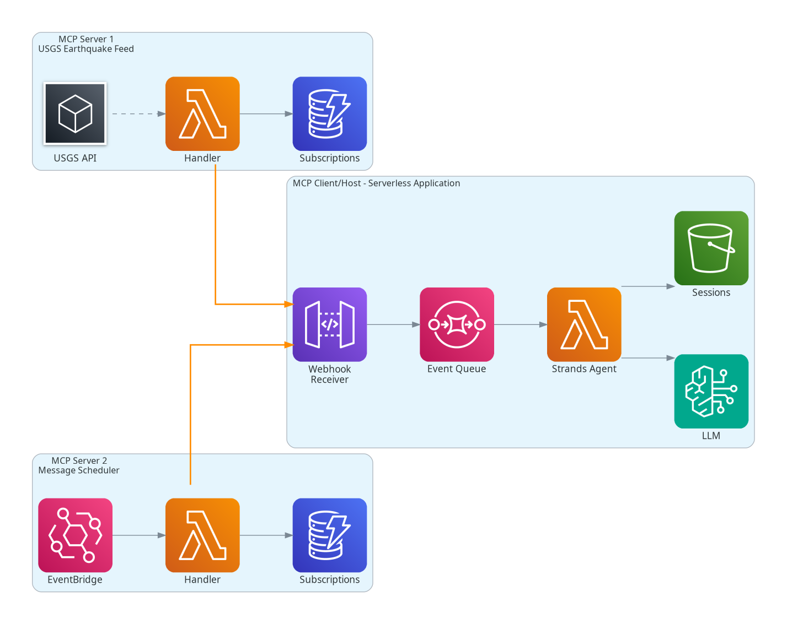
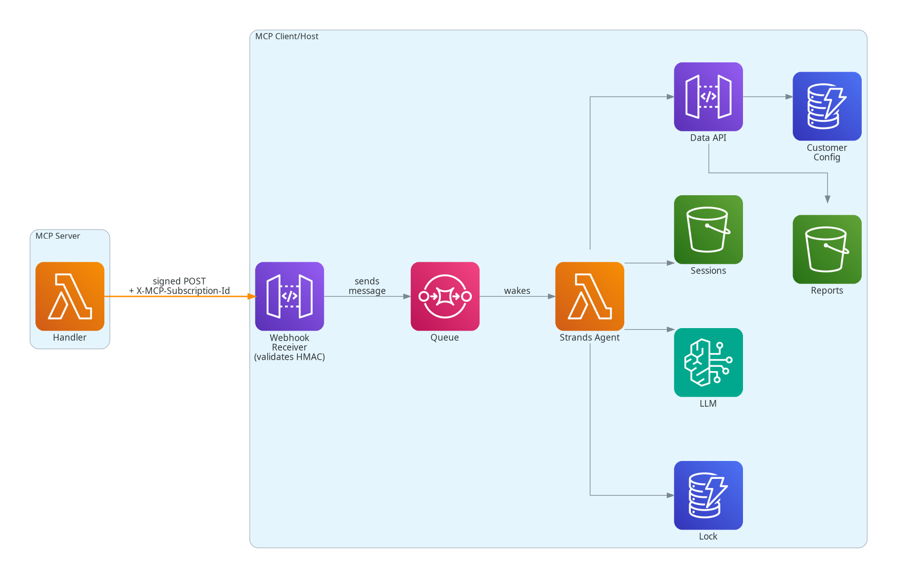
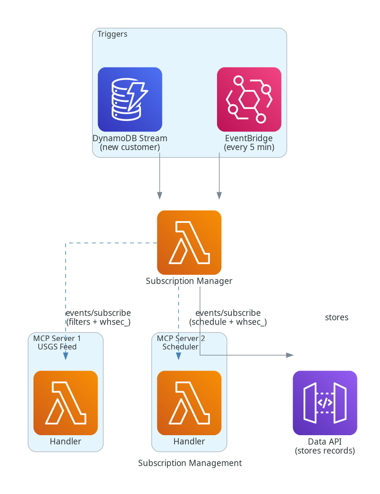
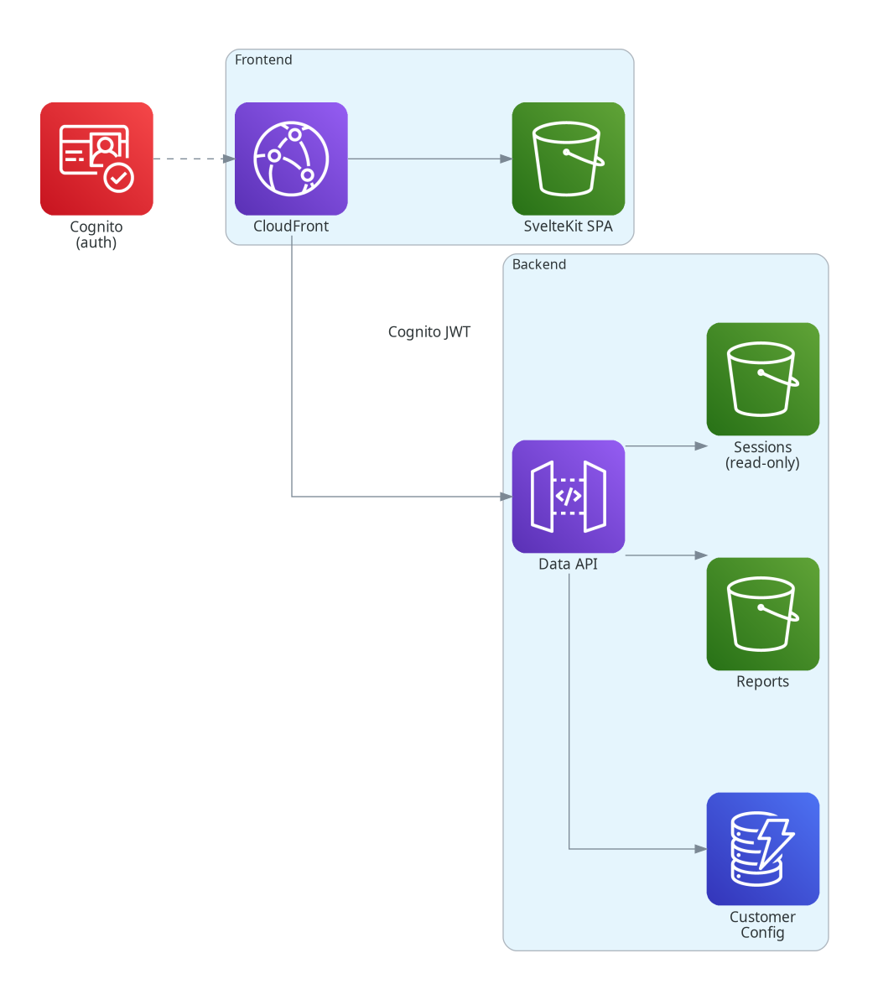

# MCP Events Serverless Agent — Earthquake Monitoring

A sample that demonstrates the experimental [MCP Triggers & Events extension](https://github.com/modelcontextprotocol/experimental-ext-triggers-events/) webhook
delivery mode, by using MCP events to wake a serverless [Strands](https://strandsagents.com)
agent.

This sample app provides multi-customer earthquake monitoring. Each user
configures their own filters (minimum magnitude, geographic region, max depth)
and briefing schedule. The agent accumulates earthquake observations in its
conversation history and periodically synthesizes them into a briefing report
for the user.

*This is sample/demo code intended to illustrate the MCP Events extension and a wake/sleep serverless agent pattern. It is not production-hardened.*

## Architecture

The system consists of:

- **MCP Servers** — declare event types, manage webhook subscriptions, deliver signed events to webhook targets
- **MCP Client/Host application** — subscribes to events, receives and processes them, manages customer state
- **External systems** — USGS API, Amazon Bedrock

At a high-level, there are three major components:

1. **MCP Server 1 — USGS Earthquake Feed** polls the USGS GeoJSON feed every 5 minutes,
  detects new earthquakes with cursor-based deduplication, and delivers each one as an
  `earthquake.detected` event to every subscription whose filter matches.
1. **MCP Server 2 — Message Scheduler** fires a `briefing.trigger` event per
  customer on that customer's configured interval (or on demand).
1. The **Strands agent** wakes on each event. Its conversation history accumulates the
  earthquake events for the customer: each earthquake becomes a user message plus an LLM analysis
  response. Each briefing trigger event asks the LLM to synthesize the whole
  conversation into a report via a `save_report` tool.

The system is entirely serverless: The agent has zero running compute until an event arrives:
webhook events wake the Lambda-hosted Strands agent just long enough to process the event and persist its state.
Likewise, both MCP servers run as Lambda functions, triggered on EventBridge schedules.
They have no long-running processes — they wake, check for work, deliver webhooks, and
exit.

The two MCP servers (top and bottom) deliver events to the client application (middle) via
signed webhooks (solid orange arrows).
Inside the client application, events flow through a Webhook
Receiver → SQS queue → Strands Agent pipeline, with the agent invoking Bedrock
for LLM analysis and persisting conversation state to S3.

### Event delivery

Each delivery is a signed HTTP POST (Standard Webhooks HMAC-SHA256) with an
`X-MCP-Subscription-Id` header that the receiver uses to look up the correct
per-subscription secret and route the event to the right customer.

When the Strands agent handler is invoked with a webhook event, it goes through the following steps:
1. It translates the MCP server's subscription ID in the event to the application's customer ID.
1. It acquires a lock on the customer ID, so that multiple agent invocations don't overwrite each other.
1. It looks up any existing agent session data (including previous conversation history)
   associated with that customer in S3, and loads it into the Strands agent.
1. It adds the event as a user message in the conversation history. This could be an earthquake event
   or a briefing event.
1. It runs the agent. For earthquake events, the LLM responds with an analysis of the most
   recent earthquake. For briefing events, the LLM calls an agent tool that stores a briefing report.
1. It stores the agent's session data back to S3. For briefing events, the session data is cleared,
   so that future reports don't contain duplicate earthquake data.
1. It releases the lock on the customer ID.

### Subscription management

The Subscription Manager is the MCP client's subscription lifecycle owner. It
calls `events/subscribe` on both servers per customer — supplying filter
parameters (magnitude, region, depth) for the earthquake feed, an interval
for the briefing trigger, and a client-generated `whsec_` signing secret for
each subscription.

The MCP servers' subscriptions also require periodic refreshing or they expire
(using TTLs on subscription records in DynamODB). The client's Subscription Manager
maintains those subscriptions by periodically calling `events/subscribe` on each
server.

### Customer webapp

Customers can self-service manage their configuration and view reports through a SvelteKit
SPA served via CloudFront. The webapp authenticates with Cognito and calls the
Data API with a JWT to manage config, read reports, and view the agent's
conversation history.

## Getting started

See [DEVELOPMENT.md](DEVELOPMENT.md) for prerequisites, install, build, lint,
test, deploy, and usage instructions.

## MCP Events design coverage

See [MCP-EVENTS-COVERAGE.md](MCP-EVENTS-COVERAGE.md) for a detailed breakdown
of which parts of the
[MCP Events design sketch](https://github.com/modelcontextprotocol/experimental-ext-triggers-events/blob/pja/design-sketch/docs/design-sketch-proposal.md)
are implemented in this project.

## License

Apache-2.0.
